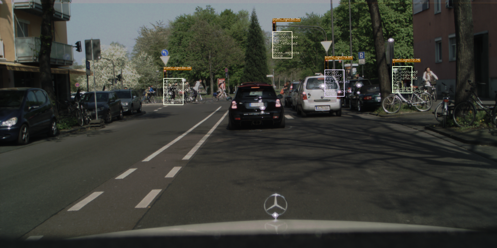
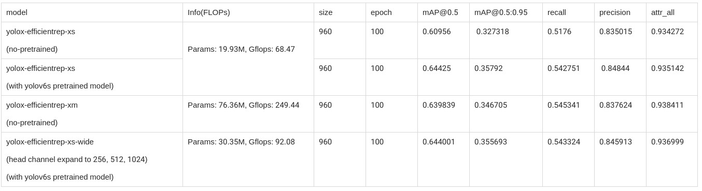
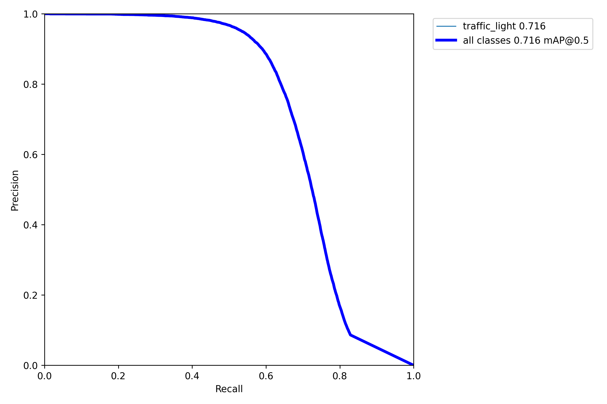

# YOLOX_augment

## Features

* Add attribute detection branch and evaluate code(using DTLD/SGTLS[private] dataset for traffic-light detection).
* Add yolov5 evaluate code, plot eval results like yolov5. And modify VOC evaluate code.
* Add fpn-p2/pan-p2 for small object detection.
* Add support of mt-yolov6 efficient-rep backbone.


### Attributes

Add attribute detection branch and evaluate code(using DTLD dataset). The visualization results is as below:


```
For DTLD dataset, there are 8 types of attributes. The definition is as below:
    {
        "orientation"   : ["vertical", "horizontal"],
        "occlusion"     : ["occluded", "not_occluded"],
        "relevance"     : ["relevant", "not_relevant"],
        "reflection"    : ["reflected", "not_reflected"],
        "direction"     : ["front", "back", "left", "right"],
        "state"         : ["red", "green", "yellow", "red_yellow", "off", "unknown"],
        "aspects"       : ["one_aspect", "two_aspects", "three_aspects", "four_aspects", "unknown"],
        "pictogram"     : ["circle", "arrow_left", "arrow_right", "arrow_straight",
                            "tram", "pedestrian", "bicycle", "unknown",
                            "pedestrian_bicycle", "arrow_straight_left"]
    }

xs_attr_960.py describes about how to train a detect model with attributes. The result is as below:

yolox-s 
 
without attributes(input_size=640):
╒══════════╤══════════╤═════════════╤══════════╤══════════╤══════════════╤════════════╤═══════════════╤═══════════════╕
│   images │   labels │   Precision │   Recall │   mAP@.5 │   mAP@.5:.95 │   f1(best) │   tp(best-f1) │   fp(best-f1) │
╞══════════╪══════════╪═════════════╪══════════╪══════════╪══════════════╪════════════╪═══════════════╪═══════════════╡
│    12453 │    91982 │    0.835614 │ 0.475865 │ 0.569389 │     0.316157 │   0.606398 │         43771 │          8611 │
╘══════════╧══════════╧═════════════╧══════════╧══════════╧══════════════╧════════════╧═══════════════╧═══════════════╛
 
with attributes(input_size=640):
╒══════════╤══════════╤═════════════╤══════════╤══════════╤══════════════╤════════════╤═══════════════╤═══════════════╕
│   images │   labels │   Precision │   Recall │   mAP@.5 │   mAP@.5:.95 │   f1(best) │   tp(best-f1) │   fp(best-f1) │
╞══════════╪══════════╪═════════════╪══════════╪══════════╪══════════════╪════════════╪═══════════════╪═══════════════╡
│    12453 │    91982 │    0.845218 │ 0.458231 │ 0.563534 │     0.308646 │   0.594277 │         42149 │          7719 │
╘══════════╧══════════╧═════════════╧══════════╧══════════╧══════════════╧════════════╧═══════════════╧═══════════════╛
╒════════════╤═══════════════╤═════════════╤═════════════╤══════════════╤═════════════╤═════════════╤═════════════╤═════════════╤══════════════╕
│ tp=43953   │   orientation │   occlusion │   relevance │   reflection │   direction │       state │     aspects │   pictogram │          All │
╞════════════╪═══════════════╪═════════════╪═════════════╪══════════════╪═════════════╪═════════════╪═════════════╪═════════════╪══════════════╡
│ error_nums │             0 │ 3546        │ 5027        │    24        │  998        │ 3799        │ 2881        │ 7146        │ 23421        │
├────────────┼───────────────┼─────────────┼─────────────┼──────────────┼─────────────┼─────────────┼─────────────┼─────────────┼──────────────┤
│ accuracy   │             1 │    0.919323 │    0.885628 │     0.999454 │    0.977294 │    0.913567 │    0.934453 │    0.837417 │     0.933392 │
╘════════════╧═══════════════╧═════════════╧═════════════╧══════════════╧═════════════╧═════════════╧═════════════╧═════════════╧══════════════╛


```


### EfficientRep backbone

rep_xs_attr_960.py describes about how to train a yolox model with EfficientRep backbone. The results of Yolox-efficientrep on DTLD dataset:




### P2 Neck

xs_attr_f2_960.py and xs_attr_p234.py describes about how to train a yolox model with P2 Neck.


### Yolov5 evaluate code



